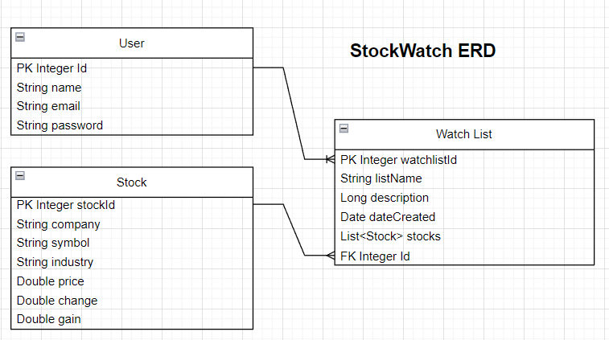

# StockWatch - Spring Boot API
<h1>Introduction</h1>
As a beginner or novice investor, it’s important to make informed financial decisions. StockWatch is designed to simplify the complexities of the stock market.  Gain valuable insights, set personalized alerts, and track your favorite stocks with ease. With StockWatch, you can confidently make sound purchases when the time comes to invest in your first stock.
<h1>Project Overview</h1>
The Stockwatch API application is designed to provide backend functionality without the need for full CRUD operations and authentication. It utilizes Java RestAPI to handle the persistence of three models, allowing the API endpoints to perform CRUD tasks based on specific business use cases. In addition, the application includes a frontend built with Angular that communicates with the Spring Boot backend API, creating a comprehensive solution for managing stock-related data. To check out the frontend UI and repository, <a href="https://github.com/vnpugh/StockWatch_Frontend">click here.</a>
<h2>Running the Application</h2>
To get started, first clone the repository. Next, open the application in your Java IDE. 
<h1>The Planning Process</h1>

Given the time constraints to complete this project, it was neccessary to define the project objectives and requirements early on.
Utilizing GitHub Projects to create a road map was helpful and served as a visual representation of the project's progress and milestones. This
helped me to break down the development tasks into smaller, manageable units. Please take a look at my Github Projects Board <a href="https://github.com/users/vnpugh/projects/5/views/1?layout=board">HERE.</a>

<h2>ERD Diagram</h2>

<h2>Tools & Technologies Used</h2>
<ul>
  <li> Project Management: Github Projects (Kanban Board)</li>
  <li>ERD: Diagrams.net</li>
  <li>IntelliJ (IDE)</li>
  <li>Markup Table Generator</li>
 <li>BDD Testing: Cucumber</li>
<li>H2 Database Engine</li>
<li> API Testing: Postman</li>
<li>Spring Boot (Framework)</li>
<li>Spring Data JPA (ORM)</li>
<li>Spring Security (Authentication)</li>
<li>Spring Web (RESTful Web Services)</li>
<li>JWT (Token)</li>
<li>Tomcat (Server)</li>
<li>Java (Programming Language)</li>
<li>Maven (Dependency Management)</li>
</ul>
<h2>User Stories (MVP)</h2>
<ul>
<li>As a user, I want to be able to register for a new account, so that I can create a custom watchlist and access personalized features.</li>
<li>As a user, I want to be able to log in to my account, so that I can securely view and manage my watchlist.</li>
<li>As a user, I want to be able to search for stocks by company name or ticker symbol, so that I can quickly find the information I need.</li>
<li>As a user, I want to be able to create a custom watchlist, so that I can organize and track the stocks I'm interested in.</li>
<li>As a user, I want to be able to view all the stocks on my watchlist, so that I can see the current status and performance of each stock.</li>
<li>As a user, I want to be able to add a stock to my watchlist by entering its ticker symbol, so that I can easily keep track of its updates and changes.</li>
<li>As a user, I want to be able to delete a stock from my watchlist, in case I'm no longer interested in tracking that particular stock.</li>
</ul>
<h2>REST API Endpoints</h2>
<table class="tg">
<thead>
  <tr>
    <th class="tg-c3ow">Request Type</th>
    <th class="tg-c3ow">URL</th>
    <th class="tg-c3ow">Functionality</th>
    <th class="tg-0pky">Access</th>
  </tr>
</thead>
<tbody>
  <tr>
    <td class="tg-0pky">POST</td>
    <td class="tg-0pky">/auth/users/register</td>
    <td class="tg-0pky">A new user can register for an account with their credentials</td>
    <td class="tg-0pky">Public</td>
  </tr>
  <tr>
    <td class="tg-0pky">POST</td>
    <td class="tg-0pky">/auth/users/login</td>
    <td class="tg-0pky">A registered user can login to their account</td>
    <td class="tg-0pky">Public</td>
  </tr>
  <tr>
    <td class="tg-0pky">POST</td>
    <td class="tg-0pky">/api/watchlist/create</td>
    <td class="tg-0pky">Create a custom watchlist</td>
    <td class="tg-0pky">Private</td>
  </tr>
  <tr>
    <td class="tg-0pky">GET</td>
    <td class="tg-0pky">/api/stocks/companyOrSymbol?company=&amp;symbol=</td>
    <td class="tg-0pky">Search for stocks by company name or ticker symbol</td>
    <td class="tg-0pky">Private</td>
  </tr>
  <tr>
    <td class="tg-0pky">POST</td>
    <td class="tg-0pky">/api/watchlist/addStock?symbol=&amp;watchlist_id=</td>
    <td class="tg-0pky">Add a stock to a watchlist by ticker symbol</td>
    <td class="tg-0pky">Private</td>
  </tr>
  <tr>
    <td class="tg-0pky">GET</td>
    <td class="tg-0pky">/api/watchlist/stocks?id=</td>
    <td class="tg-0pky">View all stocks on a custom watchlist</td>
    <td class="tg-0pky">Private</td>
  </tr>
  <tr>
    <td class="tg-0pky">DELETE</td>
    <td class="tg-0pky">/api/watchlist/deleteStocks</td>
    <td class="tg-0pky">Delete a stock from a watchlist</td>
    <td class="tg-0pky">Private</td>
  </tr>

</tbody>
</table>
<h1>Resources & Documentation Used</h1>
<ul>
<li>Creating Forms and Styling in Angular: <a href="https://material.angular.io/">Angular Material</a></li>
  <li>Health Indicators in Spring Boot: <a href="https://www.baeldung.com/spring-boot-health-indicators">Baeldung</a></li>
<li>Debugging Issues: <a href="https://stackoverflow.com/questions/45370178/exporting-a-package-from-system-module-is-not-allowed-with-release">StackOverflow</a></li>
<li>Creating User Registration in Angular: <a href="https://jasonwatmore.com/post/2022/11/29/angular-14-user-registration-and-login-example-tutorial#home-component-html">Jason Watmore</a></li>
<li>HTTP Status Codes: <a href="https://developer.mozilla.org/en-US/docs/Web/HTTP/Status">Mozilla Developer</a></li>
<li>MVN Repository: <a href="https://mvnrepository.com/artifact/org.springframework.boot/spring-boot-starter-web/3.0.5">SpringBoot Starter Web</a></li>
<li>JWT: <a href="https://jwt.io/introduction">JWT Debugger</a></li>
</ul>
<h1>Credits / MVPS:star::star::star::star::star:</h1>

Thank you to all of the instructors and my classmates for your assistance!

<ul>
<li><a href="https://github.com/sureshmelvinsigera/">Suresh Sigera</a></li>
<li><a href="https://github.com/LRodriguez9">Leo Rodriguez</a></li>
<li><a href="https://github.com/akshayankolekar">akshayankolekar: </a>Thank you for answering my questions and explaining how to make the project better!</li>
<li><a href="https://github.com/maklaut007">Maksym Zinchenko</a></li>
<li><a href="https://github.com/Jaypad07">Jay Padilla:</a> Cucumber Debugging Session</li>
</ul>
